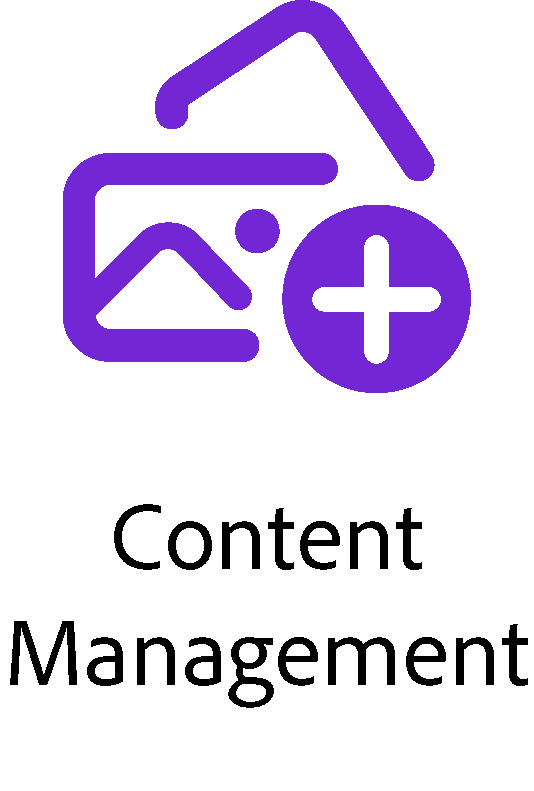

# Concepts

GenStudio for Performance Marketing är en fristående företagsprodukt som ger möjlighet att effektivisera marknadsföringskampanjer genom att skapa en leveranskedja med Adobe innehåll. Det är en utmaning att bygga personaliserat, varumärkesgodkänt innehåll i stor skala, övervaka effektiviteten och snabbt anpassa sig till den ständigt föränderliga marknaden. GenStudio for Performance Marketing sammanför Creative Cloud och Experience Cloud i en applikation som utnyttjar generativ AI som en multiplikator för företagets marknadsföringsteam.

Med GenStudio for Performance Marketing kan du

- Skapa varumärkesanpassat innehåll med naturliga språktips
- Samarbeta med intressenter för att granska och godkänna genererat innehåll
- Spara genererat och godkänt innehåll för framtida marknadsföringskampanjer
- Utvärdera innehållsprestanda med insikter om kampanjer och innehållsattribut

## Generativ AI-teknik

GenStudio for Performance Marketing utnyttjar den kraftfulla AI-funktionen för att snabba upp framtagningen av innehåll och säkerställa högklassig generering av innehåll. Den iterativa livscykeln för ert kreativa material resulterar i allt exaktare och varumärkesanpassat innehåll som når er målgrupp.

Börja med att effektivt utbilda GenStudio for Performance Marketing om företagets varumärke, kundprofiler och produktbeskrivningar med hjälp av den kraftfulla funktionen för varumärkesriktlinjer.

Se [Riktlinjerna - översikt](../user-guide/guidelines/overview.md) om du vill veta mer om hur du förbereder och överför dessa riktlinjer.

## Innehållets livscykel

Efterfrågan är hög för upplevelser av hög kvalitet i flera kanaler i snabbare takt. GenStudio for Performance Marketing förenklar innehållsleveranskedjan till ett välorganiserat arbetsflöde för marknadsförare. GenStudio for Performance Marketing utnyttjar Adobe i alla faser av livscykeln.

<table style="table-layout:fixed">
<tr style="border: 0;">
    <td style="width: 120px;">
       
    </td>
    <td>
        
Brainstorm-idéer, definiera riktlinjer och bygg en strategi runt innehållet för att engagera er målgrupp.

    </td>
</tr>
<tr style="border: 0;">
    <td style="width: 120px;">
        
    </td>
    <td>
        
Producera innehållet baserat på planen. Samarbeta i realtid, få feedback, redigera och godkänn material.

    </td>
</tr>
<tr style="border: 0;">
    <td style="width: 120px;">
        
    </td>
    <td>
        
Lagra, dela och hitta kreativa resurser i det centraliserade arkivet. Återanvänd och återuppliva innehåll baserat på prestanda.

    </td>
</tr>
<tr style="border: 0;">
    <td style="width: 120px;">
        
    </td>
    <td>
        
Aktivera innehåll och publicera i flera marknadsföringskanaler.

    </td>
</tr>
<tr style="border: 0;">
    <td style="width: 120px;">
        
    </td>
    <td>
        
Samla in data och ta fram insikter för optimering av tillgångsprestanda.

    </td>
</tr>
</table>
